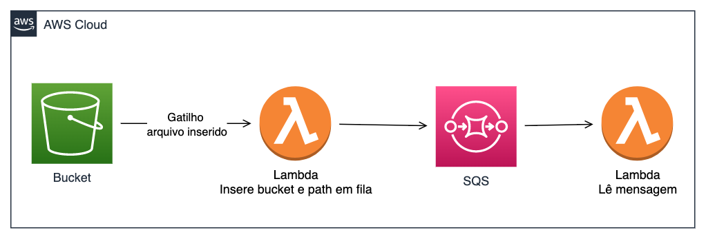

# Exercício 1

Crie um script que irá:
  1. Criar uma fila
  2. Recuperar a URL da fila via boto3 e guardar em uma variavel
  3. Postar 10 mensagens da fila criada
  4. Ler 10 mensagens da fila criada
  5. Deletar a fila

Utilize as respostas de cada chamada do boto3 para atribuir a variáveis se necessário e para imprimir informações de cada passo no terminal afim de conseguir acompanhar em qual passo do script estamos.


# Exercício 2

Crie os scripts python para a seguinte arquitetura:



Serão necessários 3 scritps python:
  1. Criar uma fila SQS
  2. Lambda que recebe a mensagem gatilho do S3 cada vez que o PNG é colocado no bucket e envia bucket e chave do objeto para o SQS
  3. Lambda que imprime a mensagem do SQS e apaga o arquivo do S3


Voce irá subir a infraestrutura de lambdas com serverless framework com o seguinte `serverless.yml`
```yaml
service: exercicio-sqs-s3

frameworkVersion: '3'

custom:
  sqsARN: arn:aws:sqs:us-east-1:034551965284:teste
  sqsURL: https://sqs.us-east-1.amazonaws.com/034551965284/teste
  nomeBucket: teste-rafbarbo-12354
  
provider:
  name: aws
  runtime: python3.9
  region: 'us-east-1'
  memorySize: 128
  iam:
    role: !Sub arn:aws:iam::${AWS::AccountId}:role/LabRole
  environment:
    SQSURL: ${self:custom.sqsURL}
    NOMEBUCKET: ${self:custom.nomeBucket}


functions:
  s3-trigger:
    handler: s3.handler
    events:
      - s3:
          bucket: ${self:custom.nomeBucket}
          event: s3:ObjectCreated:*
          rules:
            - suffix: .png
  sqs-trigger:
    handler: sqs.handler
    events:
      - sqs:
          arn: ${self:custom.sqsARN}
          batchSize: 1
```


O script que lida com s3 deve se chamar s3.py e o do sqs deve se chamar sqs.py. Cada um deles deve conter um método chamado handler conforme o exemplo abaixo. Dentro desse método onde chegam as requisições do lambda e tudo deve ser tratado. 

```python
import json

def handler(event, context):
    print(json.dumps(event))
```

E mensagem que o primeiro lambda envia para o SQS deve seguir o modelo:
```json
{
    "bucket":"nome do bucket",
    "chave": "chave do objeto"
}
```

Para garantir que tem o serverless framework instalado execute o comando `npm install -g serverless`

Com os scripts python prontos e no mesmo lugar onde esta o serverless.yml execute o comando `sls deploy`

Para testar basta subir um arquivo .png para o bucket, se ele for deletado na sequencia quer dizer que tudo esta funcionando.
