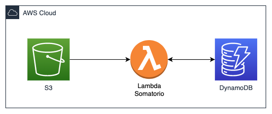

## Desafio Final




A cada arquivo .json que entrar na pasta votos do bucket um lambda deve capturar a criação desse arquivo para que leia o conteudo desse json e insira em uma tabela do dynamoDB que tem somente o ultimo resultado das somatórias totais de votos e total por candidato.


Exemplo de json que entrará no S3:
```json
{
    "votos":{
        "candidato1": 3,
        "candidato2": 4
    }
}
```

Exemplo dos 3 objetos que serão inseridos no dynamoDB:
```json
{
    "candidato":"totaldevotos",
    "total":7
}
{
    "candidato":"candidato1",
    "total":3
}
{
    "candidato":"candidato2",
    "total":4
}
```

Se chegar um segundo arquivo de votação:

```json
{
    "votos":{
        "candidato1": 1,
        "candidato5": 2
    }
}
```

Serão inseridos no dynamoDB os seguintes dados:

```json
{
    "candidato":"totaldevotos",
    "total":10
}
{
    "candidato":"candidato1",
    "total":4
}
{
    "candidato":"candidato5",
    "total":2
}
```


### Entregável

1. Serverless.yml para provisionar o lambda e trigger do S3
2. Script python do lambda criado para resolver o problema proposto
3. Arquivos json utilizados no teste(Ao menos 5)
4. Um print dos itens no dynamoDB após inserir somente os arquivos do entregavel 3


### Ajuda

- [S3 trigger serverless framework](https://www.serverless.com/framework/docs/providers/aws/events/s3)

- [Classe para lidar com DynamoDB](https://github.com/vamperst/fiap-serverless-architecture-tutorials/blob/master/03-Dynamo/baseDAO.py)
- Lembre de que o S3 é criado pelo serverless framework

